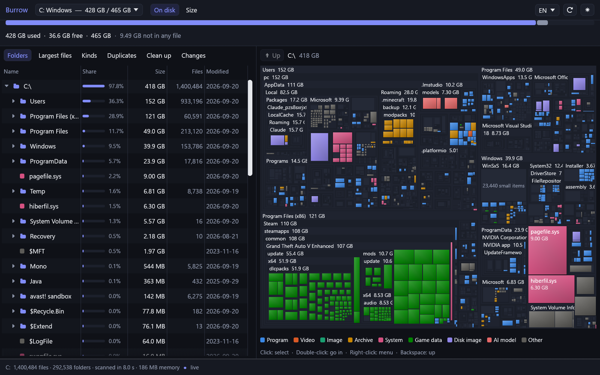

# Burrow

**Why is my disk full?** Burrow reads an NTFS drive's master file table
directly, adds up every folder, and shows the result as a treemap next to a
folder tree — for a system disk of 1.4 million files, in under ten seconds.
Then it keeps the picture true while you clean up, tells you what is safe to
remove, finds duplicate files, and shows what grew since the last time you
looked.

[Türkçe](README.tr.md)



## What it does

- **Scans in seconds.** Instead of walking directories — millions of system
  calls — Burrow reads `$MFT`, the table NTFS itself keeps of every file, in
  one sequential pass. The engine is [Ferret](https://github.com/VertexSoftwareDev/ferret)'s.
- **Measures what fills the disk.** Sizes are *size on disk*, read from each
  file's run list: compressed and sparse files count what they store, hard
  links count once, cloud-only placeholders count nothing, alternate data
  streams and directory indexes count what they hold. A bar across the top
  splits used space into what files hold and what no file does (shadow
  copies, NTFS bookkeeping).
- **Treemap and tree, one selection.** Every file is a rectangle whose area
  is its size, coloured by kind. Click a tile to find it in the tree; double
  click a folder to go into it.
- **Live.** Burrow follows the NTFS change journal. Delete something in
  Explorer, or let a download finish, and the map updates itself within
  about two seconds. No rescan.
- **Clean up, with a reason.** Rules for the places that fill Windows disks
  again and again — temp folders, browser and shader caches, Windows Update
  downloads, crash dumps, `node_modules`, Rust `target` folders, old
  installers — each marked *safe*, *probably safe* or *careful*, each
  explaining itself.
- **Duplicates.** Files with identical contents, found by comparing sizes
  first, then the first and last 64 KB, and only then whole files. Cloud-only
  files are never read, so never downloaded. Copies an application or Windows
  reads from an exact path are shown locked: the waste is real and worth
  seeing, but it is not yours to delete, so it is not counted as reclaimable.
- **What grew.** Folder sizes are recorded after every scan. Compare any
  earlier record with today, and the list goes straight to the folder where
  the growth happened — not `C:\Users`, but the folder inside it that swelled.
- **Nothing is deleted permanently.** Everything removed goes to the Recycle
  Bin, after a confirmation that says how much and what. One safety policy
  stands between every removal and the disk, and the worker asks it again at
  the last moment: Windows, installed programs, other people's profiles, a
  profile's own skeleton and applications' data cannot be removed from here,
  each refusal saying why.
- Turkish and English, dark and light.

### Clean up

Each suggestion says how sure it is and what it would remove; the safe ones
are ticked, and everything removed goes to the Recycle Bin.


### Duplicates

Copies an application or Windows reads from an exact path are shown with a
padlock: the waste is real and worth seeing, but it is not Burrow's to free.


## Measured

On the development machine, a 465 GB NTFS system drive with 1.4 million
files and 294,000 folders:

| | |
|---|---|
| Scan, from nothing to a drawn map | 7–10 s |
| Folder totals for the whole tree | 140 ms |
| Memory | 186 MB |
| Sizes identical to what Windows reports, over 4,000 sampled files | 100 % |
| A new 64 MB file on the map, without a rescan | 2.2 s |
| Duplicates among files of 1 MB and more | 14,783 compared in 11.5 s: 400 groups, 3.2 GB wasted |

## Running it

Burrow reads the raw volume, and Windows allows that only to administrators.
It asks for the rights when it starts; the disk is only ever read, except for
what you explicitly send to the Recycle Bin.

```
cargo build --release -p burrow
target\release\burrow.exe
```

Rust 1.87 or newer. Windows only: it reads NTFS.

### Command line

`burrow-cli` prints the same analysis to a console:

```
burrow-cli report C          where the space went
burrow-cli verify C          check sizes against what Windows reports
burrow-cli dupes C --min 10485760
```

### Checks

Beyond `cargo test`, two checks run against the real disk:

- `burrow-cli verify C` opens a sample of files and compares every size
  with Windows' own figures.
- `burrow --selftest-live report.txt` writes a file, waits for the map to
  show it, moves it to the Recycle Bin, and waits for the map to let it go.

## How it is built

| Crate | |
|---|---|
| `ferret-core` | Ferret's MFT reader and change-journal tail, extended to stitch files that span several MFT records and to measure size on disk. |
| `burrow-tree` | Folder totals, the cleanup rules, duplicate search and snapshots. No window, all tested. |
| `burrow` | The egui window. |
| `burrow-cli` | The console tool. |

## License

MIT
