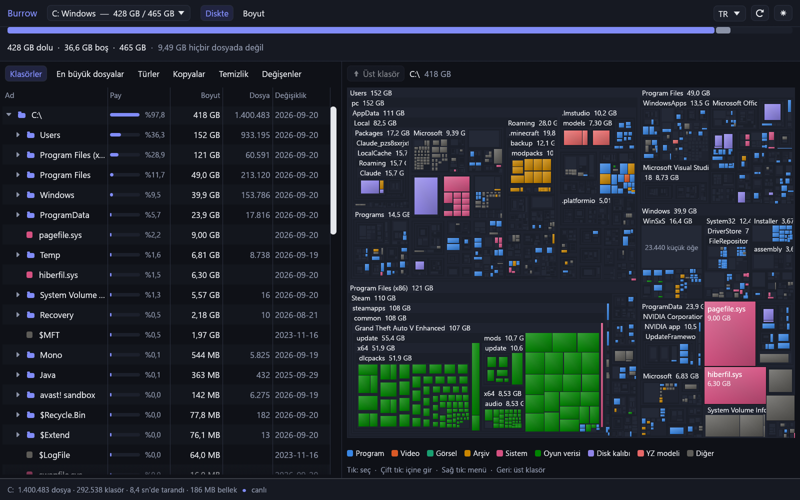
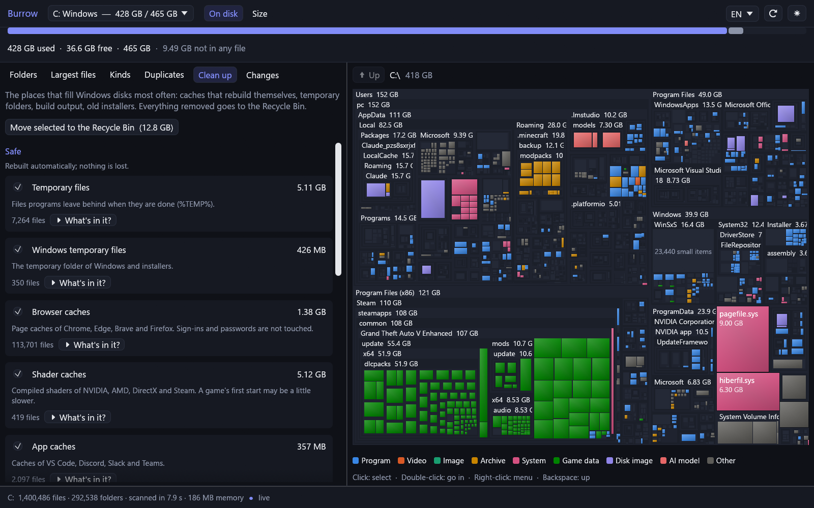
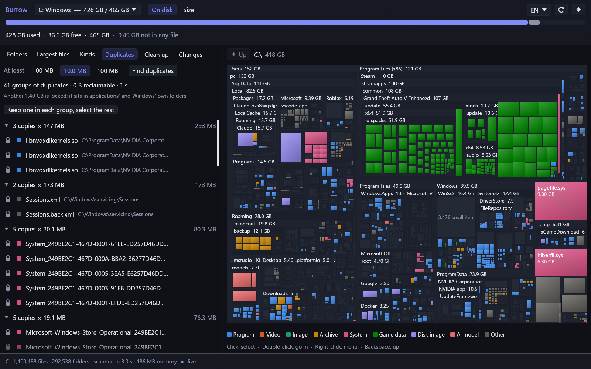

# Burrow

**Diskim neden dolu?** Burrow, NTFS sürücünün ana dosya tablosunu doğrudan
okur, her klasörü toplar ve sonucu bir klasör ağacının yanında kutucuk
haritası (treemap) olarak gösterir. 1,4 milyon dosyalık bir sistem diski on
saniyenin altında taranır. Sonra siz temizlerken haritayı güncel tutar, neyin
güvenle silinebileceğini söyler, kopya dosyaları bulur ve son baktığınızdan
beri neyin büyüdüğünü gösterir.

[English](README.md)



## Neler yapar

- **Saniyeler içinde tarar.** Klasörleri tek tek gezmek yerine (milyonlarca
  sistem çağrısı) NTFS'in her dosyayı kaydettiği `$MFT` tablosunu tek
  seferde okur. Motor [Ferret](https://github.com/VertexSoftwareDev/ferret)'inkidir.
- **Diski dolduranı ölçer.** Boyutlar *diskte kaplanan* alandır ve her
  dosyanın veri parçalarından okunur. Sıkıştırılmış ve seyrek dosyalar
  gerçekten sakladıkları kadar sayılır. Hard link'ler bir kez sayılır.
  Yalnızca bulutta duran dosyalar hiç sayılmaz. Üstteki çubuk dolu alanı
  dosyaların tuttuğu ve hiçbir dosyaya ait olmayan (gölge kopyalar, NTFS
  kayıtları) diye ikiye ayırır.
- **Harita ve ağaç, tek seçim.** Her dosya, alanı boyutu kadar olan bir
  kutucuktur ve türüne göre renklenir. Bir kutucuğa tıklayınca ağaçta
  bulunur. Bir klasöre çift tıklayınca içine girilir.
- **Canlı.** Burrow NTFS değişiklik günlüğünü izler. Explorer'da bir şey
  silin ya da bir indirme bitsin, harita iki saniye içinde kendini günceller.
  Yeniden taramaya gerek yok.
- **Gerekçesiyle temizlik.** Windows disklerini tekrar tekrar dolduran
  yerler için kurallar var: geçici klasörler, tarayıcı ve gölgelendirici
  önbellekleri, Windows Update indirmeleri, çökme dökümleri,
  `node_modules`, Rust `target` klasörleri, eski kurulum dosyaları. Her biri
  *güvenli*, *büyük olasılıkla güvenli* ya da *dikkat* olarak işaretlenir ve
  kendini açıklar.
- **Kopyalar.** İçeriği birebir aynı dosyalar bulunur. Önce boyutlar,
  sonra dosyaların ilk ve son 64 KB'ı, en son yalnızca hâlâ eşleşenlerin
  tamamı karşılaştırılır. Yalnızca bulutta duran dosyalar okunmaz, yani
  indirilmez. Bir uygulamanın veya Windows'un tam o yoldan kullandığı
  kopyalar kilitli gösterilir: israf gerçektir ve görülmeye değer, ama
  sizin silebileceğiniz bir şey olmadığı için geri kazanılabilir sayılmaz.
- **Ne büyüdü?** Her taramadan sonra klasör boyutları kaydedilir. Eski bir
  kaydı bugünle karşılaştırın. Liste doğrudan büyümenin olduğu klasöre iner:
  `C:\Users` değil, içinde şişen klasör.
- **Hiçbir şey kalıcı olarak silinmez.** Kaldırılan her şey, ne kadar ve ne
  olduğunu söyleyen bir onaydan sonra Geri Dönüşüm Kutusu'na gider. Her
  silme ile disk arasında tek bir güvenlik politikası durur ve worker son
  anda bir kez daha sorar: Windows, kurulu programlar, başka kullanıcıların
  dosyaları, profilin kendi iskeleti ve uygulama verileri buradan silinemez,
  her ret nedeniyle birlikte söylenir.
- Türkçe ve İngilizce, koyu ve açık tema.

### Temizlik

Her öneri ne kadar emin olduğunu ve neyi kaldıracağını söyler. Güvenli olanlar
işaretli gelir ve kaldırılan her şey Geri Dönüşüm Kutusu'na gider.



### Kopyalar

Bir uygulamanın veya Windows'un tam o yoldan kullandığı kopyalar asma kilitle
gösterilir: israf gerçektir ve görülmeye değer, ama Burrow'un silebileceği bir
şey değildir.



## Ölçümler

Geliştirme makinesinde, 1,4 milyon dosya ve 294.000 klasör içeren 465 GB'lık
bir NTFS sistem diskinde:

| | |
|---|---|
| Sıfırdan çizilmiş haritaya tarama | 7–10 sn |
| Tüm ağacın klasör toplamları | 140 ms |
| Bellek | 186 MB |
| Rastgele 4.000 dosyada Windows'un bildirdiği boyutla birebir aynı | %100 |
| Yeni 64 MB'lık bir dosyanın, yeniden taramadan haritaya girmesi | 2,2 sn |
| 1 MB ve üstü dosyalarda kopya araması | 14.783 dosya 11,5 sn'de: 400 grup, 3,2 GB israf |

## Çalıştırma

Burrow diski doğrudan okur ve Windows buna yalnızca yöneticilerin izin
verir. Açılırken bu izni ister. Açıkça Geri Dönüşüm Kutusu'na
gönderdikleriniz dışında diske yalnızca okuma yapılır.

```
cargo build --release -p burrow
target\release\burrow.exe
```

Rust 1.87 veya daha yenisi gerekir. Yalnızca Windows'ta çalışır, çünkü
NTFS okur.

### Komut satırı

`burrow-cli` aynı analizi konsola yazar:

```
burrow-cli report C          alan nereye gitmiş
burrow-cli verify C          boyutları Windows'un bildirdiğiyle karşılaştır
burrow-cli dupes C --min 10485760
```

### Kontroller

`cargo test` dışında iki kontrol gerçek disk üzerinde çalışır:

- `burrow-cli verify C` bir dosya örneğini açar ve her boyutu Windows'un
  kendi rakamlarıyla karşılaştırır.
- `burrow --selftest-live rapor.txt` bir dosya yazar, haritada görünmesini
  bekler, onu Geri Dönüşüm Kutusu'na taşır ve haritadan çıkmasını bekler.

## Yapısı

| Crate | |
|---|---|
| `ferret-core` | Ferret'in MFT okuyucusu ve değişiklik günlüğü izleyicisi. Birden fazla MFT kaydına yayılan dosyaları birleştirecek ve diskte kaplanan alanı ölçecek şekilde genişletildi. |
| `burrow-tree` | Klasör toplamları, temizlik kuralları, kopya araması ve anlık görüntüler. Pencere yok, hepsi testli. |
| `burrow` | egui penceresi. |
| `burrow-cli` | Konsol aracı. |

## Lisans

MIT
